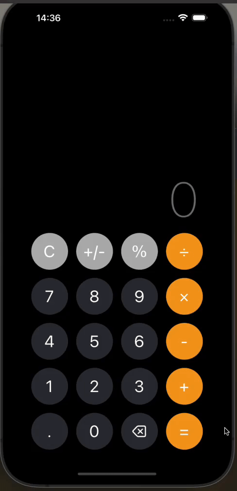

<h1>Calculator App</h1>

This project is a calculator mobile application developed using React Native, leveraging various libraries and tools to provide a functional and user-friendly calculator experience. The app includes essential calculator functionalities such as basic arithmetic operations, and it emphasizes performance, user experience, and modularity to ensure a smooth and efficient calculation process for users.

<h2>Used technologies</h2>
<ul>
    <li><strong>React Native</strong>: Utilized to build a cross-platform mobile application with native-like performance.</li>
    <li><strong>React Navigation</strong>: Integrated for smooth navigation between different screens and sections of the app using drawer navigation.</li>
</ul>
<h2>Features</h2>
<ul>
    <li><strong>Basic Arithmetic Operations</strong>: Implemented functionalities for addition, subtraction, multiplication, and division.</li>
    <li><strong>Clear and Delete</strong>: Provided options to clear the entire input or delete the last entered digit.</li>
    <li><strong>Responsive Design</strong>: Ensured compatibility across various screen sizes and orientations for a seamless user experience.</li>
    <li><strong>History</strong>: Added functionality to keep track of recent calculations.</li>
</ul>

<h2>Screen Gif</h2>

